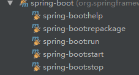
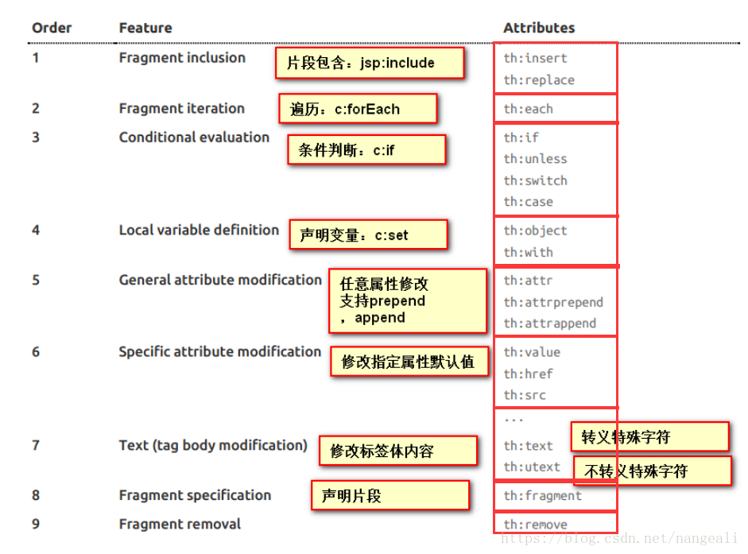
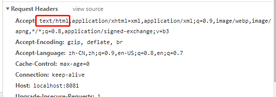
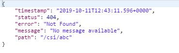
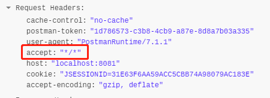
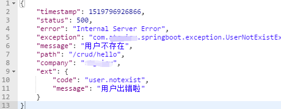
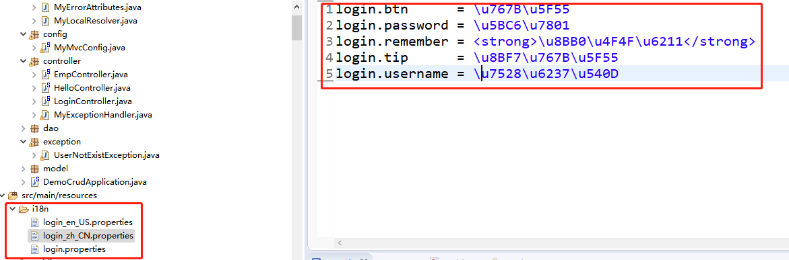
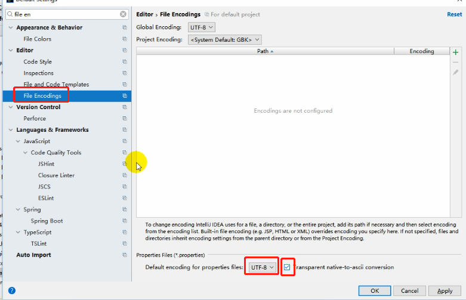

# 一、SpringBoot是什么？优缺点有哪些？

## 1、SpringBoot简介

​		随着动态语言的流行（Ruby、Groovy、Scala、Node.js），Java的开发显得格外的笨重，繁多的配置、低下的开发效率、复杂的部署流程以及第三方技术集成难度大。
​		在上述环境下，SpringBoot [2.1.9] 应运而生。它使用“习惯优于配置”（项目中存在大量的配置，此外还内置一个习惯性的配置，让你无须手动进行配置）的理念让你的项目快速运行起来。
​		使用 Spring Boot 很容易创建一个独立运行（运行 jar，内嵌 Servlet 容器）、准生产级别的基于 Spring 框架的项目，使用 Spring Boot 你可以不用或者只需要很少的 Spring 配置。

#### 1）独立运行的 Spring 项目

​		Spring Boot可以以 jar 包的形式独立运行，运行一个 Spring Boot 项目只需通过 java–jar xx.jar 来运行。
Spring Boot 可选择内嵌 Tomcat、Jetty 或者 Undertow，这样我们无须以 war 包形式部署项目。

#### 3）提供 starter 简化 Maven配置

​		Spring 提供了一系列的 starter pom 来简化 Maven 的依赖加载，例如，当你使用了spring-boot-starter-web 时，会自动加入依赖包。
​		Spring Boot 会根据在类路径中的 jar 包、类，为 jar 包里的类自动配置 Bean，这样会极大地减少我们要使用的配置。当然，Spring Boot 只是考虑了大多数的开发场景，并不是所有的场景，若在实际开发中我们需要自动配置 Bean，而 Spring Boot 没有提供支持，则可以自定义自动配置。

#### 5）准生产的应用监控

​		Spring Boot 提供基于 http、ssh、telnet 对运行时的项目进行监控。
​		Spring Boot 的神奇的不是借助于代码生成来实现的，而是通过条件注解来实现的，这是 Spring 4.x 提供的新特性。Spring 4.x 提倡使用 Java 配置和注解配置组合，而 Spring Boot 不需要任何 xml 配置即可实现 Spring 的所有配置。

## 2、Spring Boot的优缺点

#### 1）优点

- 快速构建项目。
- 对主流开发框架的无配置集成。
- 项目可独立运行，无须外部依赖Servlet容器。
- 提供运行时的应用监控。
- 极大地提高了开发、部署效率。
- 与云计算的天然集成。

#### 2）缺点

- 版本迭代速度很快，一些模块改动很大。
- 由于不用自己做配置，报错时很难定位。
- 网上现成的解决方案比较少。


# 二、Spring JavaConfig

​	 Java5 的推出，加上当年基于纯 Java Annotation 的依赖注入框架 Guice 的出现，使得Spring框架及其社区也“顺应民意”，推出并持续完善了基于 Java 代码和 Annotation 元信息的依赖关系绑定描述方式，即 JavaConfig 项目。

​	 基于 JavaConfig 方式的依赖关系绑定描述基本上映射了最早的基于 XML 的配置方式，比如：

## 1、表达形式层面

基于 XML 的配置方式是这样的：

```xml
<?xml version="1.0" encoding="UTF-8"?>
<beans xmlns="http://www.springframework.org/schema/beans"
    xmlns:xsi="http://www.w3.org/2001/XMLSchema-instance"
    xmlns:context="http://www.springframework.org/schema/context"
    xsi:schemaLocation="http://www.springframework.org/schema/beans
        http://www.springframework.org/schema/beans/spring-beans.xsd
        http://www.springframework.org/schema/context
        http://www.springframework.org/schema/context/spring-context.xsd">
   
    <!-- bean定义 -->
</beans>
```

而基于 JavaConfig 的配置方式是这样的：

```java
@Configuration
public class MockConfiguration{
    // bean定义
} 
```

任何一个标注了 @Configuration 的 Java 类定义都是一个 JavaConfig 配置类。

## 2、注册 bean 定义层面

基于 XML 的配置形式是这样的：

```xml
<bean id="mockService" class="..MockServiceImpl"> ...</bean>
```

而基于 JavaConfig 的配置形式是这样的：

```java
@Configuration
public class MockConfiguration {
    @Bean
    public MockService mockService() {
        return new MockServiceImpl();
    }
}
```

任何一个标注了 @Bean 的方法，其返回值将作为一个 bean 定义注册到 Spring 的 IoC 容器，方法名将默认成为该 bean 定义的 id。

## 3、表达依赖注入关系层面

为了表达 bean 与 bean 之间的依赖关系，在 XML 形式中一般是这样的：

```xml
<bean id="mockService" class="..MockServiceImpl">
    <property name="dependencyService" ref="dependencyService" />
</bean>
<bean id="dependencyService" class="DependencyServiceImpl" /> 
```

而在 JavaConfig 中则是这样的：

```java
@Configuration
public class MockConfiguration {
    @Bean
    public MockService mockService() {
        return new MockServiceImpl(dependencyService());
    }

    @Bean
    public DependencyService dependencyService() {
        return new DependencyServiceImpl();
    }
}
```

如果一个 bean 的定义依赖其他 bean，则直接调用对应 JavaConfig 类中依赖 bean 的创建方法就可以了。

在 JavaConfig 形式的依赖注入过程中，我们使用方法调用的形式注入依赖，如果这个方法返回的对象实例只被一个 bean 依赖注入，那也还好，如果多于一个 bean 需要依赖这个方法调用返回的对象实例，那是不是意味着我们就会创建多个同一类型的对象实例？

 从代码表述的逻辑来看，直觉上应该是会创建多个同一类型的对象实例，但实际上最终结果却不是这样，依赖注入的都是同一个 Singleton 的对象实例，那这是如何做到的？

笔者一开始以为 Spring 框架会通过解析 JavaConfig 的代码结构，然后通过解析器转换加上反射等方式完成这一目的，但实际上 Spring 框架的设计和实现者采用了另一种更通用的方式，这在 Spring 的参考文档中有说明。即通过拦截配置类的方法调用来避免多次初始化同一类型对象的问题，一旦拥有拦截逻辑的子类发现当前方法没有对应的类型实例时才会去请求父类的同一方法来初始化对象实例，否则直接返回之前的对象实例。

所以，原来 Spring IoC 容器中有的特性（features）在 JavaConfig 中都可以表述，只是换了一种形式而已，而且，通过声明相应的 Java Annotation 反而“内聚”一处，变得更加简洁明了了。  

# 三、@SpringBootApplication注解

@SpringBootApplication 是一个“三体”结构，实际上它是一个复合 Annotation：

```java
@Target(ElementType.TYPE)
@Retention(RetentionPolicy.RUNTIME)
@Documented
@Inherited
@SpringBootConfiguration
@EnableAutoConfiguration
@ComponentScan(excludeFilters = { @Filter(type = FilterType.CUSTOM, classes = TypeExcludeFilter.class),
		@Filter(type = FilterType.CUSTOM, classes = AutoConfigurationExcludeFilter.class) })
```

​		虽然它的定义使用了多个 Annotation 进行元信息标注，但实际上对于 SpringBoot 应用来说，重要的只有三个 Annotation，而“三体”结构实际上指的就是这三个 Annotation：

- @Configuration
- @EnableAutoConfiguration
- @ComponentScan

# 四、自动配置原理

配置文件到底能写什么？怎么写？自动配置原理；

[配置文件能配置的属性参照](https://docs.spring.io/spring-boot/docs/2.1.9.RELEASE/reference/html/common-application-properties.html)

### 1、**自动配置原理：**

1）、SpringBoot启动的时候加载主配置类，开启了自动配置功能 ==@EnableAutoConfiguration==

**2）、@EnableAutoConfiguration 作用：**

利用AutoConfigurationImportSelector给容器中导入一些组件？

可以查看selectImports()方法的内容；

List<String> configurations = getCandidateConfigurations(annotationMetadata,      attributes);获取候选的配置

```properties
SpringFactoriesLoader.loadFactoryNames()
扫描所有jar包类路径下  META-INF/spring.factories
把扫描到的这些文件的内容包装成properties对象
从properties中获取到EnableAutoConfiguration.class类（类名）对应的值，然后把他们添加在容器中
```


**==将 类路径下  META-INF/spring.factories 里面配置的所有EnableAutoConfiguration的值加入到了容器中；==**

```properties
# Auto Configure
org.springframework.boot.autoconfigure.EnableAutoConfiguration=\
org.springframework.boot.autoconfigure.admin.SpringApplicationAdminJmxAutoConfiguration,\
org.springframework.boot.autoconfigure.aop.AopAutoConfiguration,\
org.springframework.boot.autoconfigure.amqp.RabbitAutoConfiguration,\
org.springframework.boot.autoconfigure.batch.BatchAutoConfiguration,\
org.springframework.boot.autoconfigure.cache.CacheAutoConfiguration,\
org.springframework.boot.autoconfigure.cassandra.CassandraAutoConfiguration,\
org.springframework.boot.autoconfigure.cloud.CloudServiceConnectorsAutoConfiguration,\
org.springframework.boot.autoconfigure.context.ConfigurationPropertiesAutoConfiguration,\
org.springframework.boot.autoconfigure.context.MessageSourceAutoConfiguration,\
org.springframework.boot.autoconfigure.context.PropertyPlaceholderAutoConfiguration,\
org.springframework.boot.autoconfigure.couchbase.CouchbaseAutoConfiguration,\
org.springframework.boot.autoconfigure.dao.PersistenceExceptionTranslationAutoConfiguration,\
org.springframework.boot.autoconfigure.data.cassandra.CassandraDataAutoConfiguration,\
org.springframework.boot.autoconfigure.data.cassandra.CassandraReactiveDataAutoConfiguration,\
org.springframework.boot.autoconfigure.data.cassandra.CassandraReactiveRepositoriesAutoConfiguration,\
org.springframework.boot.autoconfigure.data.cassandra.CassandraRepositoriesAutoConfiguration,\
org.springframework.boot.autoconfigure.data.couchbase.CouchbaseDataAutoConfiguration,\
org.springframework.boot.autoconfigure.data.couchbase.CouchbaseReactiveDataAutoConfiguration,\
org.springframework.boot.autoconfigure.data.couchbase.CouchbaseReactiveRepositoriesAutoConfiguration,\
org.springframework.boot.autoconfigure.data.couchbase.CouchbaseRepositoriesAutoConfiguration,\
org.springframework.boot.autoconfigure.data.elasticsearch.ElasticsearchAutoConfiguration,\
org.springframework.boot.autoconfigure.data.elasticsearch.ElasticsearchDataAutoConfiguration,\
org.springframework.boot.autoconfigure.data.elasticsearch.ElasticsearchRepositoriesAutoConfiguration,\
org.springframework.boot.autoconfigure.data.jdbc.JdbcRepositoriesAutoConfiguration,\
org.springframework.boot.autoconfigure.data.jpa.JpaRepositoriesAutoConfiguration,\
org.springframework.boot.autoconfigure.data.ldap.LdapRepositoriesAutoConfiguration,\
org.springframework.boot.autoconfigure.data.mongo.MongoDataAutoConfiguration,\
org.springframework.boot.autoconfigure.data.mongo.MongoReactiveDataAutoConfiguration,\
org.springframework.boot.autoconfigure.data.mongo.MongoReactiveRepositoriesAutoConfiguration,\
org.springframework.boot.autoconfigure.data.mongo.MongoRepositoriesAutoConfiguration,\
org.springframework.boot.autoconfigure.data.neo4j.Neo4jDataAutoConfiguration,\
org.springframework.boot.autoconfigure.data.neo4j.Neo4jRepositoriesAutoConfiguration,\
org.springframework.boot.autoconfigure.data.solr.SolrRepositoriesAutoConfiguration,\
org.springframework.boot.autoconfigure.data.redis.RedisAutoConfiguration,\
org.springframework.boot.autoconfigure.data.redis.RedisReactiveAutoConfiguration,\
org.springframework.boot.autoconfigure.data.redis.RedisRepositoriesAutoConfiguration,\
org.springframework.boot.autoconfigure.data.rest.RepositoryRestMvcAutoConfiguration,\
org.springframework.boot.autoconfigure.data.web.SpringDataWebAutoConfiguration,\
org.springframework.boot.autoconfigure.elasticsearch.jest.JestAutoConfiguration,\
org.springframework.boot.autoconfigure.elasticsearch.rest.RestClientAutoConfiguration,\
org.springframework.boot.autoconfigure.flyway.FlywayAutoConfiguration,\
org.springframework.boot.autoconfigure.freemarker.FreeMarkerAutoConfiguration,\
org.springframework.boot.autoconfigure.gson.GsonAutoConfiguration,\
org.springframework.boot.autoconfigure.h2.H2ConsoleAutoConfiguration,\
org.springframework.boot.autoconfigure.hateoas.HypermediaAutoConfiguration,\
org.springframework.boot.autoconfigure.hazelcast.HazelcastAutoConfiguration,\
org.springframework.boot.autoconfigure.hazelcast.HazelcastJpaDependencyAutoConfiguration,\
org.springframework.boot.autoconfigure.http.HttpMessageConvertersAutoConfiguration,\
org.springframework.boot.autoconfigure.http.codec.CodecsAutoConfiguration,\
org.springframework.boot.autoconfigure.influx.InfluxDbAutoConfiguration,\
org.springframework.boot.autoconfigure.info.ProjectInfoAutoConfiguration,\
org.springframework.boot.autoconfigure.integration.IntegrationAutoConfiguration,\
org.springframework.boot.autoconfigure.jackson.JacksonAutoConfiguration,\
org.springframework.boot.autoconfigure.jdbc.DataSourceAutoConfiguration,\
org.springframework.boot.autoconfigure.jdbc.JdbcTemplateAutoConfiguration,\
org.springframework.boot.autoconfigure.jdbc.JndiDataSourceAutoConfiguration,\
org.springframework.boot.autoconfigure.jdbc.XADataSourceAutoConfiguration,\
org.springframework.boot.autoconfigure.jdbc.DataSourceTransactionManagerAutoConfiguration,\
org.springframework.boot.autoconfigure.jms.JmsAutoConfiguration,\
org.springframework.boot.autoconfigure.jmx.JmxAutoConfiguration,\
org.springframework.boot.autoconfigure.jms.JndiConnectionFactoryAutoConfiguration,\
org.springframework.boot.autoconfigure.jms.activemq.ActiveMQAutoConfiguration,\
org.springframework.boot.autoconfigure.jms.artemis.ArtemisAutoConfiguration,\
org.springframework.boot.autoconfigure.groovy.template.GroovyTemplateAutoConfiguration,\
org.springframework.boot.autoconfigure.jersey.JerseyAutoConfiguration,\
org.springframework.boot.autoconfigure.jooq.JooqAutoConfiguration,\
org.springframework.boot.autoconfigure.jsonb.JsonbAutoConfiguration,\
org.springframework.boot.autoconfigure.kafka.KafkaAutoConfiguration,\
org.springframework.boot.autoconfigure.ldap.embedded.EmbeddedLdapAutoConfiguration,\
org.springframework.boot.autoconfigure.ldap.LdapAutoConfiguration,\
org.springframework.boot.autoconfigure.liquibase.LiquibaseAutoConfiguration,\
org.springframework.boot.autoconfigure.mail.MailSenderAutoConfiguration,\
org.springframework.boot.autoconfigure.mail.MailSenderValidatorAutoConfiguration,\
org.springframework.boot.autoconfigure.mongo.embedded.EmbeddedMongoAutoConfiguration,\
org.springframework.boot.autoconfigure.mongo.MongoAutoConfiguration,\
org.springframework.boot.autoconfigure.mongo.MongoReactiveAutoConfiguration,\
org.springframework.boot.autoconfigure.mustache.MustacheAutoConfiguration,\
org.springframework.boot.autoconfigure.orm.jpa.HibernateJpaAutoConfiguration,\
org.springframework.boot.autoconfigure.quartz.QuartzAutoConfiguration,\
org.springframework.boot.autoconfigure.reactor.core.ReactorCoreAutoConfiguration,\
org.springframework.boot.autoconfigure.security.servlet.SecurityAutoConfiguration,\
org.springframework.boot.autoconfigure.security.servlet.UserDetailsServiceAutoConfiguration,\
org.springframework.boot.autoconfigure.security.servlet.SecurityFilterAutoConfiguration,\
org.springframework.boot.autoconfigure.security.reactive.ReactiveSecurityAutoConfiguration,\
org.springframework.boot.autoconfigure.security.reactive.ReactiveUserDetailsServiceAutoConfiguration,\
org.springframework.boot.autoconfigure.sendgrid.SendGridAutoConfiguration,\
org.springframework.boot.autoconfigure.session.SessionAutoConfiguration,\
org.springframework.boot.autoconfigure.security.oauth2.client.servlet.OAuth2ClientAutoConfiguration,\
org.springframework.boot.autoconfigure.security.oauth2.client.reactive.ReactiveOAuth2ClientAutoConfiguration,\
org.springframework.boot.autoconfigure.security.oauth2.resource.servlet.OAuth2ResourceServerAutoConfiguration,\
org.springframework.boot.autoconfigure.security.oauth2.resource.reactive.ReactiveOAuth2ResourceServerAutoConfiguration,\
org.springframework.boot.autoconfigure.solr.SolrAutoConfiguration,\
org.springframework.boot.autoconfigure.task.TaskExecutionAutoConfiguration,\
org.springframework.boot.autoconfigure.task.TaskSchedulingAutoConfiguration,\
org.springframework.boot.autoconfigure.thymeleaf.ThymeleafAutoConfiguration,\
org.springframework.boot.autoconfigure.transaction.TransactionAutoConfiguration,\
org.springframework.boot.autoconfigure.transaction.jta.JtaAutoConfiguration,\
org.springframework.boot.autoconfigure.validation.ValidationAutoConfiguration,\
org.springframework.boot.autoconfigure.web.client.RestTemplateAutoConfiguration,\
org.springframework.boot.autoconfigure.web.embedded.EmbeddedWebServerFactoryCustomizerAutoConfiguration,\
org.springframework.boot.autoconfigure.web.reactive.HttpHandlerAutoConfiguration,\
org.springframework.boot.autoconfigure.web.reactive.ReactiveWebServerFactoryAutoConfiguration,\
org.springframework.boot.autoconfigure.web.reactive.WebFluxAutoConfiguration,\
org.springframework.boot.autoconfigure.web.reactive.error.ErrorWebFluxAutoConfiguration,\
org.springframework.boot.autoconfigure.web.reactive.function.client.ClientHttpConnectorAutoConfiguration,\
org.springframework.boot.autoconfigure.web.reactive.function.client.WebClientAutoConfiguration,\
org.springframework.boot.autoconfigure.web.servlet.DispatcherServletAutoConfiguration,\
org.springframework.boot.autoconfigure.web.servlet.ServletWebServerFactoryAutoConfiguration,\
org.springframework.boot.autoconfigure.web.servlet.error.ErrorMvcAutoConfiguration,\
org.springframework.boot.autoconfigure.web.servlet.HttpEncodingAutoConfiguration,\
org.springframework.boot.autoconfigure.web.servlet.MultipartAutoConfiguration,\
org.springframework.boot.autoconfigure.web.servlet.WebMvcAutoConfiguration,\
org.springframework.boot.autoconfigure.websocket.reactive.WebSocketReactiveAutoConfiguration,\
org.springframework.boot.autoconfigure.websocket.servlet.WebSocketServletAutoConfiguration,\
org.springframework.boot.autoconfigure.websocket.servlet.WebSocketMessagingAutoConfiguration,\
org.springframework.boot.autoconfigure.webservices.WebServicesAutoConfiguration,\
org.springframework.boot.autoconfigure.webservices.client.WebServiceTemplateAutoConfiguration
```

每一个这样的  xxxAutoConfiguration类都是容器中的一个组件，都加入到容器中；用他们来做自动配置；

3）、每一个自动配置类进行自动配置功能；

4）、以**HttpEncodingAutoConfiguration（Http编码自动配置）**为例解释自动配置原理；

```java
// 表示这是一个配置类，以前编写的配置文件一样，也可以给容器中添加组件
@Configuration

// 启动指定类的ConfigurationProperties功能；将配置文件中对应的值和HttpProperties绑定起来；并把HttpProperties加入到ioc容器中
@EnableConfigurationProperties(HttpProperties.class)

// Spring底层@Conditional注解（Spring注解版），根据不同的条件，如果满足指定的条件，整个配置类里面的配置就会生效；
// 判断当前应用是否是Servlet应用，如果是，当前配置类生效
@ConditionalOnWebApplication(type = ConditionalOnWebApplication.Type.SERVLET)

// 判断当前项目有没有这个类CharacterEncodingFilter；SpringMVC中进行乱码解决的过滤器；
@ConditionalOnClass(CharacterEncodingFilter.class)

// 判断配置文件中是否存在某个配置  spring.http.encoding.enabled；如果不存在，判断也是成立的
// 即使我们配置文件中不配置pring.http.encoding.enabled=true，也是默认生效的；
@ConditionalOnProperty(prefix = "spring.http.encoding", value = "enabled", matchIfMissing = true)
public class HttpEncodingAutoConfiguration {

    // 他已经和SpringBoot的配置文件映射了
	private final HttpProperties.Encoding properties;

    // 只有一个有参构造器的情况下，参数的值就会从容器中拿
	public HttpEncodingAutoConfiguration(HttpProperties properties) {
		this.properties = properties.getEncoding();
	}
	
    
	@Bean // 给容器中添加一个组件，这个组件的某些值需要从properties中获取
	@ConditionalOnMissingBean // 判断容器没有这个组件？
	public CharacterEncodingFilter characterEncodingFilter() {
		CharacterEncodingFilter filter = new OrderedCharacterEncodingFilter();
		filter.setEncoding(this.properties.getCharset().name());
		filter.setForceRequestEncoding(this.properties.shouldForce(Type.REQUEST));
		filter.setForceResponseEncoding(this.properties.shouldForce(Type.RESPONSE));
		return filter;
	}

	........

}
```

根据当前不同的条件判断，决定这个配置类是否生效？

一但这个配置类生效；这个配置类就会给容器中添加各种组件；这些组件的属性是从对应的properties类中获取的，这些类里面的每一个属性又是和配置文件绑定的；

5）、所有在配置文件中能配置的属性都是在xxxxProperties类中封装者‘；配置文件能配置什么就可以参照某个功能对应的这个属性类

```java
//  从配置文件中获取指定的值和bean的属性进行绑定  
@ConfigurationProperties(prefix = "spring.http")
public class HttpProperties {
    public static final Charset DEFAULT_CHARSET = StandardCharsets.UTF_8;
    
    private Charset charset = DEFAULT_CHARSET;
    
}
```


**精髓：**

​	**1）、SpringBoot启动会加载大量的自动配置类**

​	**2）、我们看我们需要的功能有没有SpringBoot默认写好的自动配置类；**

​	**3）、我们再来看这个自动配置类中到底配置了哪些组件；（只要我们要用的组件有，我们就不需要再来配置了）**

​	**4）、给容器中自动配置类添加组件的时候，会从properties类中获取某些属性。我们就可以在配置文件中指定这些属性的值；**


xxxxAutoConfigurartion：自动配置类；

给容器中添加组件

xxxxProperties:封装配置文件中相关属性；


### 2、细节

#### 1、@Conditional派生注解（Spring注解版原生的@Conditional作用）

作用：必须是@Conditional指定的条件成立，才给容器中添加组件，配置配里面的所有内容才生效；

| @Conditional扩展注解            | 作用（判断是否满足当前指定条件）                 |
| ------------------------------- | ------------------------------------------------ |
| @ConditionalOnJava              | 系统的java版本是否符合要求                       |
| @ConditionalOnBean              | 容器中存在指定Bean；                             |
| @ConditionalOnMissingBean       | 容器中不存在指定Bean；                           |
| @ConditionalOnExpression        | 满足SpEL表达式指定                               |
| @ConditionalOnClass             | 系统中有指定的类                                 |
| @ConditionalOnMissingClass      | 系统中没有指定的类                               |
| @ConditionalOnSingleCandidate   | 容器中只有一个指定的Bean，或者这个Bean是首选Bean |
| @ConditionalOnProperty          | 系统中指定的属性是否有指定的值                   |
| @ConditionalOnResource          | 类路径下是否存在指定资源文件                     |
| @ConditionalOnWebApplication    | 当前是web环境                                    |
| @ConditionalOnNotWebApplication | 当前不是web环境                                  |
| @ConditionalOnJndi              | JNDI存在指定项                                   |

**自动配置类必须在一定的条件下才能生效；**

我们怎么知道哪些自动配置类生效；

**==我们可以通过启用  debug=true（或--debug）属性；来让控制台打印自动配置报告==**，这样我们就可以很方便的知道哪些自动配置类生效；

```java
============================
CONDITIONS EVALUATION REPORT
============================

Positive matches:（自动配置类启用的）
-----------------

CodecsAutoConfiguration matched:
      - @ConditionalOnClass found required class 'org.springframework.http.codec.CodecConfigurer' (OnClassCondition)

CodecsAutoConfiguration.JacksonCodecConfiguration matched:
      - @ConditionalOnClass found required class 'com.fasterxml.jackson.databind.ObjectMapper' (OnClassCondition)
        
    
Negative matches:（没有启动，没有匹配成功的自动配置类）
-----------------

ActiveMQAutoConfiguration:
	Did not match:
         - @ConditionalOnClass did not find required class 'javax.jms.ConnectionFactory' (OnClassCondition)

AopAutoConfiguration:
      Did not match:
  		- @ConditionalOnClass did not find required class 'org.aspectj.lang.annotation.Aspect' (OnClassCondition)
        
```


# 四、配置文件

## 1、配置文件

SpringBoot使用一个全局的配置文件，配置文件名是固定的；

•application.properties

•application.yml


配置文件的作用：修改SpringBoot自动配置的默认值；SpringBoot在底层都给我们自动配置好；


YAML（YAML Ain't Markup Language）

​	YAML  A Markup Language：是一个标记语言

​	YAML   isn't Markup Language：不是一个标记语言；

标记语言：

​	以前的配置文件；大多都使用的是  **xxxx.xml**文件；

​	YAML：**以数据为中心**，比json、xml等更适合做配置文件；

​	YAML：配置例子

```yaml
server:
  port: 8081
```

​	XML：

```xml
<server>
	<port>8081</port>
</server>
```


## 2、YAML语法：

### 1、基本语法

k:(空格)v：表示一对键值对（空格必须有）；

以**空格**的缩进来控制层级关系；只要是左对齐的一列数据，都是同一个层级的

```yaml
server:
    port: 8081
    path: /hello
```

属性和值也是大小写敏感；


### 2、值的写法

#### 字面量：普通的值（数字，字符串，布尔）

​	k: v：字面直接来写；

​		字符串默认不用加上单引号或者双引号；

​		""：双引号；不会转义字符串里面的特殊字符；特殊字符会作为本身想表示的意思

​				name:   "zhangsan \n lisi"：输出；zhangsan 换行  lisi

​		''：单引号；会转义特殊字符，特殊字符最终只是一个普通的字符串数据

​				name:   ‘zhangsan \n lisi’：输出；zhangsan \n  lisi


#### 对象、Map（属性和值）（键值对）：

​	k: v：在下一行来写对象的属性和值的关系；注意缩进

​		对象还是k: v的方式

```yaml
friends:
		lastName: zhangsan
		age: 20
```

行内写法：

```yaml
friends: {lastName: zhangsan,age: 18}
```


#### 数组（List、Set）：

用- 值表示数组中的一个元素

```yaml
pets:
 - cat
 - dog
 - pig
```

行内写法

```yaml
pets: [cat,dog,pig]
```


## 3、配置文件值注入

配置文件

```yaml
person:
    lastName: hello
    age: 18
    boss: false
    birth: 2017/12/12
    maps: {k1: v1,k2: 12}
    lists:
      - lisi
      - zhaoliu
    dog:
      name: 小狗
      age: 12
```

javaBean：

```java
/**
 * 将配置文件中配置的每一个属性的值，映射到这个组件中
 * @ConfigurationProperties：告诉SpringBoot将本类中的所有属性和配置文件中相关的配置进行绑定；
 *      prefix = "person"：配置文件中哪个下面的所有属性进行一一映射
 *
 * 只有这个组件是容器中的组件，才能容器提供的@ConfigurationProperties功能；
 *
 */
@Component
@ConfigurationProperties(prefix = "person")
public class Person {

    private String lastName;
    private Integer age;
    private Boolean boss;
    private Date birth;

    private Map<String,Object> maps;
    private List<Object> lists;
    private Dog dog;

```


我们可以导入配置文件处理器，以后编写配置就有提示了

```xml
<!--导入配置文件处理器，配置文件进行绑定就会有提示-->
<dependency>
    <groupId>org.springframework.boot</groupId>
    <artifactId>spring-boot-configuration-processor</artifactId>
    <optional>true</optional>
</dependency>
```


#### 1、@Value获取值和@ConfigurationProperties获取值比较

|                      | @ConfigurationProperties | @Value     |
| -------------------- | ------------------------ | ---------- |
| 功能                 | 批量注入配置文件中的属性 | 一个个指定 |
| 松散绑定（松散语法） | 支持                     | 不支持     |
| SpEL                 | 不支持                   | 支持       |
| JSR303数据校验       | 支持                     | 不支持     |
| 复杂类型封装         | 支持                     | 不支持     |

配置文件yml还是properties他们都能获取到值；

如果说，我们只是在某个业务逻辑中需要获取一下配置文件中的某项值，使用@Value；

如果说，我们专门编写了一个javaBean来和配置文件进行映射，我们就直接使用@ConfigurationProperties；


#### 2、配置文件注入值数据校验

```java
@Component
@ConfigurationProperties(prefix = "person")
@Validated
public class Person {

    /**
     * <bean class="Person">
     *      <property name="lastName" value="字面量/${key}从环境变量、配置文件中获取值/#{SpEL}"></property>
     * <bean/>
     */

   //lastName必须是邮箱格式
    @Email
    //@Value("${person.last-name}")
    private String lastName;
    //@Value("#{11*2}")
    private Integer age;
    //@Value("true")
    private Boolean boss;

    private Date birth;
    private Map<String,Object> maps;
    private List<Object> lists;
    private Dog dog;
```


#### 3、@PropertySource&@ImportResource&@Bean

@**PropertySource**：加载指定的配置文件；

```java
/**
 * 将配置文件中配置的每一个属性的值，映射到这个组件中
 * @ConfigurationProperties：告诉SpringBoot将本类中的所有属性和配置文件中相关的配置进行绑定；
 *      prefix = "person"：配置文件中哪个下面的所有属性进行一一映射
 *
 * 只有这个组件是容器中的组件，才能容器提供的@ConfigurationProperties功能；
 *  @ConfigurationProperties(prefix = "person")默认从全局配置文件中获取值；
 *
 */
@PropertySource(value = {"classpath:person.properties"})
@Component
@ConfigurationProperties(prefix = "person")
//@Validated
public class Person {

    /**
     * <bean class="Person">
     *      <property name="lastName" value="字面量/${key}从环境变量、配置文件中获取值/#{SpEL}"></property>
     * <bean/>
     */

   //lastName必须是邮箱格式
   // @Email
    //@Value("${person.last-name}")
    private String lastName;
    //@Value("#{11*2}")
    private Integer age;
    //@Value("true")
    private Boolean boss;

```


@**ImportResource**：导入Spring的配置文件，让配置文件里面的内容生效；

Spring Boot里面没有Spring的配置文件，我们自己编写的配置文件，也不能自动识别；

想让Spring的配置文件生效，加载进来；@**ImportResource**标注在一个配置类上

```java
@ImportResource(locations = {"classpath:beans.xml"})
导入Spring的配置文件让其生效
```


不来编写Spring的配置文件

```xml
<?xml version="1.0" encoding="UTF-8"?>
<beans xmlns="http://www.springframework.org/schema/beans"
       xmlns:xsi="http://www.w3.org/2001/XMLSchema-instance"
       xsi:schemaLocation="http://www.springframework.org/schema/beans http://www.springframework.org/schema/beans/spring-beans.xsd">


    <bean id="helloService" class="com.atguigu.springboot.service.HelloService"></bean>
</beans>
```


SpringBoot推荐给容器中添加组件的方式；推荐使用全注解的方式

1、配置类**@Configuration**------>Spring配置文件

2、使用**@Bean**给容器中添加组件

```java
/**
 * @Configuration：指明当前类是一个配置类；就是来替代之前的Spring配置文件
 *
 * 在配置文件中用<bean><bean/>标签添加组件
 *
 */
@Configuration
public class MyAppConfig {

    //将方法的返回值添加到容器中；容器中这个组件默认的id就是方法名
    @Bean
    public HelloService helloService02(){
        System.out.println("配置类@Bean给容器中添加组件了...");
        return new HelloService();
    }
}
```

##4、配置文件占位符

### 1、随机数

```java
${random.value}、${random.int}、${random.long}
${random.int(10)}、${random.int[1024,65536]}

```


### 2、占位符获取之前配置的值，如果没有可以是用:指定默认值

```properties
person.last-name=张三${random.uuid}
person.age=${random.int}
person.birth=2017/12/15
person.boss=false
person.maps.k1=v1
person.maps.k2=14
person.lists=a,b,c
person.dog.name=${person.hello:hello}_dog
person.dog.age=15
```


## 5、Profile

#### 1、多Profile文件

我们在主配置文件编写的时候，文件名可以是   application-{profile}.properties/yml

默认使用application.properties的配置；


#### 2、yml支持多文档块方式

```yml
server:
  port: 8081
spring:
  profiles:
    active: prod

---
server:
  port: 8083
spring:
  profiles: dev


---

server:
  port: 8084
spring:
  profiles: prod  #指定属于哪个环境
```


#### 3、激活指定profile

​	1、在配置文件中指定  spring.profiles.active=dev

​	2、命令行：

​		java -jar spring-boot-02-config-0.0.1-SNAPSHOT.jar --spring.profiles.active=dev；

​		可以直接在测试的时候，配置传入命令行参数

​	3、虚拟机参数；

​		-Dspring.profiles.active=dev


## 6、配置文件加载位置

springboot 启动会扫描以下位置的application.properties或者application.yml文件作为Spring boot的默认配置文件

–file:./config/

–file:./

–classpath:/config/

–classpath:/

优先级由高到底，高优先级的配置会覆盖低优先级的配置；

SpringBoot会从这四个位置全部加载主配置文件；**互补配置**；


==我们还可以通过spring.config.location来改变默认的配置文件位置==

**项目打包好以后，我们可以使用命令行参数的形式，启动项目的时候来指定配置文件的新位置；指定配置文件和默认加载的这些配置文件共同起作用形成互补配置；**

java -jar spring-boot-02-config-02-0.0.1-SNAPSHOT.jar --spring.config.location=G:/application.properties


## 7、外部配置加载顺序

**==SpringBoot也可以从以下位置加载配置； 优先级从高到低；高优先级的配置覆盖低优先级的配置，所有的配置会形成互补配置==**

**1.命令行参数**

所有的配置都可以在命令行上进行指定

java -jar spring-boot-02-config-02-0.0.1-SNAPSHOT.jar --server.port=8087  --server.context-path=/abc

多个配置用空格分开； --配置项=值


2.来自java:comp/env的JNDI属性

3.Java系统属性（System.getProperties()）

4.操作系统环境变量

5.RandomValuePropertySource配置的random.*属性值


==**由jar包外向jar包内进行寻找；**==

==**优先加载带profile**==

**6.jar包外部的application-{profile}.properties或application.yml(带spring.profile)配置文件**

**7.jar包内部的application-{profile}.properties或application.yml(带spring.profile)配置文件**


==**再来加载不带profile**==

**8.jar包外部的application.properties或application.yml(不带spring.profile)配置文件**

**9.jar包内部的application.properties或application.yml(不带spring.profile)配置文件**


10.@Configuration注解类上的@PropertySource

11.通过SpringApplication.setDefaultProperties指定的默认属性

所有支持的配置加载来源；

[参考官方文档](https://docs.spring.io/spring-boot/docs/2.1.9.RELEASE/reference/html/boot-features-external-config.html)


# 五、Webjars及静态资源的映射规则

## 1、简介

使用SpringBoot；

**1）、创建SpringBoot应用，选中我们需要的模块；**

**2）、SpringBoot已经默认将这些场景配置好了，只需要在配置文件中指定少量配置就可以运行起来**

**3）、自己编写业务代码；**

spring-boot-autoconfigure-xxxx.jar

**自动配置原理？**

这个场景SpringBoot帮我们配置了什么？能不能修改？能修改哪些配置？能不能扩展？xxx

```
xxxxAutoConfiguration：帮我们给容器中自动配置组件；
xxxxProperties:配置类来封装配置文件的内容；
```

## 2、SpringBoot对静态资源的映射规则

**WebMvcAuotConfiguration.java**

**ResourceProperties.java**

```java
@ConfigurationProperties(prefix = "spring.resources", ignoreUnknownFields = false)
public class ResourceProperties implements ResourceLoaderAware {
  //可以设置和静态资源有关的参数，缓存时间等
```

```java
@Override
public void addResourceHandlers(ResourceHandlerRegistry registry) {
    if (!this.resourceProperties.isAddMappings()) {
        logger.debug("Default resource handling disabled");
        return;
    }
    Integer cachePeriod = this.resourceProperties.getCachePeriod();
    if (!registry.hasMappingForPattern("/webjars/**")) {
        customizeResourceHandlerRegistration(
            registry.addResourceHandler("/webjars/**")
            .addResourceLocations(
                "classpath:/META-INF/resources/webjars/")
            .setCachePeriod(cachePeriod));
    }
    String staticPathPattern = this.mvcProperties.getStaticPathPattern();
    //静态资源文件夹映射
    if (!registry.hasMappingForPattern(staticPathPattern)) {
        customizeResourceHandlerRegistration(
            registry.addResourceHandler(staticPathPattern)
            .addResourceLocations(
                this.resourceProperties.getStaticLocations())
            .setCachePeriod(cachePeriod));
    }
}

// 配置欢迎页映射，getWelcomePage(),静态资源文件夹下的index
// 被getStaticPathPattern()所映射
@Bean
public WelcomePageHandlerMapping welcomePageHandlerMapping(ApplicationContext applicationContext) {
    WelcomePageHandlerMapping welcomePageHandlerMapping = new WelcomePageHandlerMapping(
					new TemplateAvailabilityProviders(applicationContext), applicationContext, getWelcomePage(),
					this.mvcProperties.getStaticPathPattern());
    welcomePageHandlerMapping.setInterceptors(getInterceptors());
    return welcomePageHandlerMapping;
}

//配置喜欢的图标
@Configuration
@ConditionalOnProperty(value = "spring.mvc.favicon.enabled", matchIfMissing = true)
public static class FaviconConfiguration implements ResourceLoaderAware {

    private final ResourceProperties resourceProperties;

    private ResourceLoader resourceLoader;

    public FaviconConfiguration(ResourceProperties resourceProperties) {
        this.resourceProperties = resourceProperties;
    }

    @Override
    public void setResourceLoader(ResourceLoader resourceLoader) {
        this.resourceLoader = resourceLoader;
    }

    @Bean
    public SimpleUrlHandlerMapping faviconHandlerMapping() {
        SimpleUrlHandlerMapping mapping = new SimpleUrlHandlerMapping();
        mapping.setOrder(Ordered.HIGHEST_PRECEDENCE + 1);
        // 都是在静态资源文件夹下favicon.ico，更改标题图标
        mapping.setUrlMap(Collections.singletonMap("**/favicon.ico", faviconRequestHandler()));
        return mapping;
    }

    @Bean
    public ResourceHttpRequestHandler faviconRequestHandler() {
        ResourceHttpRequestHandler requestHandler = new ResourceHttpRequestHandler();
        requestHandler.setLocations(resolveFaviconLocations());
        return requestHandler;
    }

    private List<Resource> resolveFaviconLocations() {
        String[] staticLocations = getResourceLocations(this.resourceProperties.getStaticLocations());
        List<Resource> locations = new ArrayList<>(staticLocations.length + 1);
        Arrays.stream(staticLocations).map(this.resourceLoader::getResource).forEach(locations::add);
        locations.add(new ClassPathResource("/"));
        return Collections.unmodifiableList(locations);
    }

}

}

```

==1）、所有 /webjars/** ，都去 classpath:/META-INF/resources/webjars/ 找资源；==

​	webjars：以jar包的方式引入静态资源；

http://www.webjars.org/

localhost:8080/webjars/jquery/3.3.1/jquery.js

```xml
<!--引入jquery-webjar-->在访问的时候只需要写webjars下面资源的名称即可
<dependency>
    <groupId>org.webjars</groupId>
    <artifactId>jquery</artifactId>
    <version>3.3.1</version>
</dependency>
```

==2）、"/**" 访问当前项目的任何资源，都去（静态资源的文件夹）找映射==

```
"classpath:/META-INF/resources/", 
"classpath:/resources/",
"classpath:/static/", 
"classpath:/public/" 
"/"：当前项目的根路径
```

localhost:8080/abc ===  去静态资源文件夹里面找abc

==3）、欢迎页； 静态资源文件夹下的所有index.html页面；被"/**"映射；静态资源中如果未找到，去模板目录下寻找==

​	localhost:8080/   找index页面

==4）、所有的 **/favicon.ico  都是在静态资源文件下找；==

==5）、变更静态文件夹路径（ResourceProperties）==

```xml
spring.resources.static-locations=classpath:/hello/,classpath:/csi/
```

# 六、JSP在SpringBoot中应用（可选）

​		由于官方对jsp不友好，在内嵌的servlet容器中运行一个Spring Boot应用时（并打包成一个可执行的存档archive），容器对JSP的支持有一些限制。 

1.  tomcat只支持war的打包方式，不支持可执行的jar。

2. 内嵌的Jetty目前不支持JSPs。 

3. Undertow不支持JSPs。 

**如果需要使用，可做如下操作：**

新建的项目由于没有webapp目录，所以需要自行添加 

**1.添加webapp目录**

src/mian/webapp/WEB-INF     将jsp文件放在该目录下 

**2.配置application.properties**

```properties
# 配置前缀和后缀
spring.mvc.view.prefix=/WEB-INF/jsp/
spring.mvc.view.suffix=.jsp
```

**3.需要对 jsp的解析器**

```xml
<dependency>
   <groupId>org.apache.tomcat.embed</groupId>
   <artifactId>tomcat-embed-jasper</artifactId>
   <scope>provided</scope>
</dependency>
```

**4.如果有需要自己添加对jstl的支持**

```xml
<dependency>
   <groupId>javax.servlet</groupId>
   <artifactId>jstl</artifactId>
</dependency>
```

注意：idea运行main方法找不到jsp的解决方案




# 七、thymeleaf模板引擎

SpringBoot推荐的Thymeleaf；

语法更简单，功能更强大；

## 1、引入thymeleaf

```xml
<dependency>
    <groupId>org.springframework.boot</groupId>
    <artifactId>spring-boot-starter-thymeleaf</artifactId>
</dependency>

<!-- 如何去切换版本，git可查看最新版本 -->
<properties>
    <thymeleaf.version>3.0.11.RELEASE</thymeleaf.version>
    <thymeleaf-layout-dialect.version>2.4.1</thymeleaf-layout-dialect.version>
</properties>
```

## 2、thymeleaf部分源码解析及使用

**ThymeleafAutoConfiguration.java**

**ThymeleafProperties.java**

```java
@ConfigurationProperties(prefix = "spring.thymeleaf")
public class ThymeleafProperties {
    private static final Charset DEFAULT_ENCODING = StandardCharsets.UTF_8;

    public static final String DEFAULT_PREFIX = "classpath:/templates/";

    public static final String DEFAULT_SUFFIX = ".html";
    ....
}
```

视图解析默认添加前缀和后缀，thymeleaf自动进行渲染。

可进行thymeleaf的相关配置：

如：

```xml
spring.thymeleaf.cache=false  <!-- 禁用缓存  -->
spring.thymeleaf.mode=html
```

​		

1、引入thymeleaf名称空间:

```html
<html lang="en" xmlns:th="http://www.thymeleaf.org">
```

2、使用thymeleaf语法；

```html
<!DOCTYPE html>
<html lang="en" xmlns:th="http://www.thymeleaf.org">
<head>
    <meta charset="UTF-8">
    <title>Title</title>
</head>
<body>
    <h1>成功！</h1>
    <!--th:text 将div里面的文本内容设置为 -->
    <div th:text="${hello}">这是显示欢迎信息</div>
</body>
</html>
```

3、开发过程中，如果没有th标签没有提示，可通过插件安装实现

​	建议采用在线安装方式：Eclipse Marketplace搜索thymeleaf

​	https://github.com/thymeleaf/thymeleaf-extras-eclipse-plugin/releases

## 3、常用语法规则

1）、th:text；改变当前元素里面的文本内容；

​	     th：任意html属性；来替换原生属性的值，如：th:id,  th:class等

**10、Attribute Precedence**



2）、表达式？

**4.Standard Expression Syntax**

```properties
Simple expressions:（表达式语法-变量）
Variable Expressions: ${...}：获取变量值；OGNL；
1）、获取对象的属性、调用方法
2）、使用内置的基本对象：
    #ctx : the context object.
    #vars: the context variables.
    #locale : the context locale.
    #request : (only in Web Contexts) the HttpServletRequest object.
    #response : (only in Web Contexts) the HttpServletResponse object.
    #session : (only in Web Contexts) the HttpSession object.
    #servletContext : (only in Web Contexts) the ServletContext object.
                
     ${session.foo}
     
3）、内置的一些工具对象：
#execInfo : information about the template being processed.
#messages : methods for obtaining externalized messages inside variables expressions, in the same way as they would be obtained using #{…} syntax.
#uris : methods for escaping parts of URLs/URIs
#conversions : methods for executing the configured conversion service (if any).
#dates : methods for java.util.Date objects: formatting, component extraction, etc.
#calendars : analogous to #dates , but for java.util.Calendar objects.
#numbers : methods for formatting numeric objects.
#strings : methods for String objects: contains, startsWith, prepending/appending, etc.
#objects : methods for objects in general.
#bools : methods for boolean evaluation.
#arrays : methods for arrays.
#lists : methods for lists.
#sets : methods for sets.
#maps : methods for maps.
#aggregates : methods for creating aggregates on arrays or collections.
#ids : methods for dealing with id attributes that might be repeated (for example, as a result of an iteration).

Selection Variable Expressions: *{...}：选择表达式：和${}在功能上是一样，区别可取对象；
    补充：配合 th:object="${session.user}：
Demo:    
<div th:object="${session.user}">
    <p>Name: <span th:text="*{firstName}">Sebastian</span>.</p>
    <p>Surname: <span th:text="*{lastName}">Pepper</span>.</p>
    <p>Nationality: <span th:text="*{nationality}">Saturn</span>.</p>
</div>
    
Message Expressions: #{...}：获取国际化内容

Link URL Expressions: @{...}：定义URL；
	@{/order/process(execId=${execId},execType='FAST')}

Fragment Expressions: ~{...}：片段引用表达式
    <div th:insert="~{commons :: main}">...</div>

12、行内表达式  [[]]   [()]
    
th:if

th:each

th:fragment
    		
Literals（字面量）
    Text literals: 'one text' , 'Another one!' ,…
    Number literals: 0 , 34 , 3.0 , 12.3 ,…
    Boolean literals: true , false
    Null literal: null
    Literal tokens: one , sometext , main ,…
      
Text operations:（文本操作）
    String concatenation: +
    Literal substitutions: |The name is ${name}|
    
Arithmetic operations:（数学运算）
    Binary operators: + , - , * , / , %
    Minus sign (unary operator): -
    
Boolean operations:（布尔运算）
    Binary operators: and , or
    Boolean negation (unary operator): ! , not
    
Comparisons and equality:（比较运算）
    Comparators: > , < , >= , <= ( gt , lt , ge , le )
    Equality operators: == , != ( eq , ne )
    
Conditional operators:条件运算（三元运算符）
    If-then: (if) ? (then)
    If-then-else: (if) ? (then) : (else)
    Default: (value) ?: (defaultvalue)
    
Special tokens:
    No-Operation: _ 
```


# 八、热部署项目

只需要添加相关依赖即可

```xml
<dependencies>
	<dependency>
		<groupId>org.springframework.boot</groupId>
		<artifactId>spring-boot-devtools</artifactId>
		<optional>true</optional>
	</dependency>
</dependencies>
```

# 九、数据库

## 1、JDBC

#### 1）添加相关的依赖

```xml
<!-- 指定数据库版本 -->
<properties>
    <mysql.version>5.1.47</mysql.version>
</properties>
<!--JDBC-->
<dependency>
    <groupId>org.springframework.boot</groupId>
    <artifactId>spring-boot-starter-data-jdbc</artifactId>
</dependency>
<!--数据库驱动-->
<dependency>
    <groupId>mysql</groupId>
    <artifactId>mysql-connector-java</artifactId>
    <scope>runtime</scope>
</dependency>
```

#### 2）添加  数据源 配置

```yaml
spring:
  datasource:
    username: root
    password: 123123
    url: jdbc:mysql://localhost:3306/db_hrm?useUnicode=true&amp;characterEncoding=UTF-8
    driver-class-name: com.mysql.jdbc.Driver
```

#### 3）Test类中测试连接

```java
@RunWith(SpringRunner.class)
@SpringBootTest
public class SpringBootMybatisApplicationTests {
	// 注入数据源
	@Autowired
	DataSource dataSource;
	
	@Test
	public void contextLoads() throws SQLException {
        // 查看数据源
		System.out.println(dataSource.getClass());
        // 获取连接
		Connection conn = dataSource.getConnection();
		System.out.println(conn);
        // 关闭连接
		conn.close();
	}
}
```

效果：老版本默认采用org.apache.tomcat.jdbc.pool.DataSource作为数据源； 2.1.9版本采用com.zaxxer.hikari.HikariDataSource作为数据源；

数据源的相关配置都在DataSourceProperties里面；

#### 4）自动配置原理

1、参考DataSourceConfiguration，根据配置创建数据源；默认使用Hikari连接池；可以使用 

spring.datasource.type指定自定义的数据源类型； 

2、SpringBoot默认可以支持；

```java
org.apache.tomcat.jdbc.pool.DataSource
com.zaxxer.hikari.HikariDataSource
org.apache.commons.dbcp2.BasicDataSource
```

3、自定义配置数据源

```java
/**
* Generic DataSource configuration.
*/
@Configuration
@ConditionalOnMissingBean(DataSource.class)
@ConditionalOnProperty(name = "spring.datasource.type")
static class Generic {
    @Bean
    public DataSource dataSource(DataSourceProperties properties) {
        // 使用DataSourceBuilder创建数据源，利用反射创建响应type的数据源，并且绑定相关属性
        return properties.initializeDataSourceBuilder().build();
    }

}
```

4、DataSourceAutoConfiguration--->DataSourceInitializer

作用：

​		createSchema()：执行建表语句

​		initSchema()：执行插入数据的sql语句

```properties
默认sql规则
schema-${platform}.sql   data-${platform}.sql

自定义sql脚本名称
spring.datasource.schema = classpath:dept.sql
```

注意：springboot2.x系列，需要加入配置

```yaml
#表示始终执行初始化
spring: 
  datasource: 
     initialization-mode=always
```


5、SpringBoot：自动配置了JdbcTemplate操作数据库

JdbcTemplate具体用法可参照：https://www.cnblogs.com/caoyc/p/5630622.html

```java
@RunWith(SpringRunner.class)
@SpringBootTest
public class SpringBootJdbctestApplicationTests {
	
	@Autowired
	DataSource dataSource;

	@Test
	public void contextLoads() throws SQLException {
		JdbcTemplate jt = new JdbcTemplate(dataSource);
		RowMapper<Dept> rowMapper=new BeanPropertyRowMapper<Dept>(Dept.class);
		List<Dept> list = jt.query("SELECT * FROM dept", rowMapper);
		System.out.println(list.get(0));
	}
}
```

## 2、整合Druid数据源（可选）

简介：阿里提供的数据源产品，提供了整套数据源监控或安全，性能略低于HikariDataSource

#### 1）引入数据源

```xml
<!--引入durid数据源-->
<dependency>
    <groupId>com.alibaba</groupId>
    <artifactId>druid</artifactId>
    <version>1.1.20</version>
</dependency>
<!--需要log4j的支持-->
<dependency>
    <groupId>log4j</groupId>
    <artifactId>log4j</artifactId>
    <version>1.2.17</version>
</dependency>
```

#### 2）变更默认数据源

```yaml
spring:
  datasource:
    type: com.alibaba.druid.pool.DruidDataSource
```

druid数据源相关配置

```yaml
spring:
  datasource:
      initialSize: 5
      minIdle: 5
      maxActive: 20
      maxWait: 60000
      timeBetweenEvictionRunsMillis: 60000
      minEvictableIdleTimeMillis: 300000
      validationQuery: SELECT 1 FROM DUAL
      testWhileIdle: true
      testOnBorrow: false
      testOnReturn: false
      poolPreparedStatements: true
      #   配置监控统计拦截的filters，去掉后监控界面sql无法统计，'wall'用于防火墙
      filters: stat,wall,log4j
      maxPoolPreparedStatementPerConnectionSize: 20
      useGlobalDataSourceStat: true
      connectionProperties: druid.stat.mergeSql=true;druid.stat.slowSqlMillis=500
```

注意：默认情况下，无法将配置绑定到dataSource中，需要进行配置

手动进行配置，不让SpringBoot自动配置，并且可以额外添加Druid的监控

```java
@Configuration
public class DruidConfig {

	@ConfigurationProperties(prefix = "spring.datasource")
	@Bean
	public DataSource druid() {
		// DruidDataSource存在映射属性
		return new DruidDataSource();
	}

	// 配置Druid的监控：
	// 1、配置一个管理后台的Servlet,StatViewServlet：控制进入后台管理的Servlet
	@Bean
	public ServletRegistrationBean<StatViewServlet> statViewServlet() {
		
        ServletRegistrationBean<StatViewServlet> bean = new ServletRegistrationBean<>(new StatViewServlet(),
				"/druid/*");

		// ResourceServlet中属性设定
		Map<String, String> initParameters = new HashMap<String, String>();
		initParameters.put("loginUsername", "admin");
		initParameters.put("loginPassword", "123123");
		initParameters.put("allow", ""); // 默认允许所有访问
		initParameters.put("deny", "192.168.10.21");
		bean.setInitParameters(initParameters);
		return bean;
	}

	// 2.配置一个Web监控的filter
	@Bean
	public FilterRegistrationBean<WebStatFilter> webStatFilter() {
		FilterRegistrationBean<WebStatFilter> bean = new FilterRegistrationBean<WebStatFilter>();
		bean.setFilter(new WebStatFilter());
		// 设置初始化参数
		Map<String, String> initParameters = new HashMap<String, String>();
		// 排除静态资源的一些拦截，包括druid的
		initParameters.put("exclusions", "*.js,*.css,/druid/*");
		bean.setInitParameters(initParameters);
		// 拦截所有请求
		bean.setUrlPatterns(Arrays.asList("/*"));
		return bean;
	}
}
```

访问地址：localhost:8081/druid


## 3、整合MyBatis

#### 1）引入相应starter POMs

```xml
<dependency>
    <groupId>org.mybatis.spring.boot</groupId>
    <artifactId>mybatis-spring-boot-starter</artifactId>
    <version>2.1.0</version>
</dependency>
<!--查看pom.xml依赖层次关系，Denpendency Hierarchy-->
```

**MybatisAutoConfiguration.java**

**MybatisProperties.java**


#### 2）注解版

操作数据库Demo

```java
//指定这是一个操作数据库的mapper
//@Mapper
public interface DepartmentMapper {

    @Select("select * from department where id=#{id}")
    public Department getDeptById(Integer id);

    @Delete("delete from department where id=#{id}")
    public int deleteDeptById(Integer id);

    @Options(useGeneratedKeys = true,keyProperty = "id") // 获取id值返回
    @Insert("insert into department(department_name) values(#{departmentName})")
    public int insertDept(Department department);

    @Update("update department set department_name=#{departmentName} where id=#{id}")
    public int updateDept(Department department);
}
```

注意：例如：驼峰式命名配置，以JavaConfig进行配置(ConfigurationCustomizer)，自定义MyBatis规则

```java
@Configuration
public class MyBatisConfig {
	@Bean
	public ConfigurationCustomizer configurationCustomizer() {
		return new ConfigurationCustomizer() {
			@Override
			public void customize(org.apache.ibatis.session.Configuration configuration) {
                // 开启驼峰式命名
				configuration.setMapUnderscoreToCamelCase(true);
			}
		};
	}
}
```

优化：程序入口主配置或MyBatis自定义配置，添加@MapperScan(value="com.kwj.mapper")，进行批量扫描


#### 3）配置版

a.构建映射文件目录：

​	如：/xxxx/src/main/resources/mybatis/mybatis-config.xml

​	       /xxxx/src/main/resources/mybatis/mapper/UserMapper.xml

b.配置文件路径

```yaml
mybatis:
   config-location: classpath:mybatis/mybatis-config.xml  #指定全局配置文件路径
   mapper-locations: classpath:mybatis/mapper/*.xml  #指定sql映射文件的位置
```


# 十、错误处理机制

## **1）、SpringBoot默认的错误处理机制**

1）、浏览器，返回一个默认的错误页面（默认效果）


  浏览器发送请求的请求头：



2）、如果是其他客户端，默认响应一个json数据





原理：

​	ErrorMvcAutoConfiguration.java

​	可以参照ErrorMvcAutoConfiguration；错误处理的自动配置；

  	给容器中添加了以下组件

​	1、DefaultErrorAttributes（来源于ErrorAttributes接口）：

```properties
在页面共享信息
   如：timestamp：时间戳、status：状态码、error：错误提示、exception：异常对象、message：异常消息、errors：JSR303数据校验的错误都在这里
```

​	

​	2、BasicErrorController：基本错误处理器；

```java
@Controller
// 如果无server.error.path，则取error.path
// 如果无error.path，则取/error
@RequestMapping("${server.error.path:${error.path:/error}}")
public class BasicErrorController extends AbstractErrorController {
    
    // 浏览器请求头accept:text/html，产生html类型的数据
    @RequestMapping(produces = MediaType.TEXT_HTML_VALUE)
	public ModelAndView errorHtml(HttpServletRequest request, HttpServletResponse response) {
		HttpStatus status = getStatus(request);
		Map<String, Object> model = Collections
				.unmodifiableMap(getErrorAttributes(request, isIncludeStackTrace(request, MediaType.TEXT_HTML)));
		response.setStatus(status.value());
        // 调用resolveErrorView（），去哪个页面作为错误界面，包括页面地址及内容
		ModelAndView modelAndView = resolveErrorView(request, response, status, model);
		return (modelAndView != null) ? modelAndView : new ModelAndView("error", model);
	}
    
    // 其他客户端请求头accept:*/*，产生JSON数据
    @RequestMapping
	public ResponseEntity<Map<String, Object>> error(HttpServletRequest request) {
		HttpStatus status = getStatus(request);
		if (status == HttpStatus.NO_CONTENT) {
			return new ResponseEntity<Map<String, Object>>(status);
		}
		Map<String, Object> body = getErrorAttributes(request, isIncludeStackTrace(request, MediaType.ALL));
		return new ResponseEntity<>(body, status);
	}
    
}
```


​	3、ErrorPageCustomizer：

```java
@Value("${error.path:/error}")
private String path = "/error";
// 系统出现错误以后来到error请求进行处理；（web.xml）
```


​	4、DefaultErrorViewResolver：

```java
@Override
public ModelAndView resolveErrorView(HttpServletRequest request, HttpStatus status, Map<String, Object> model) {
    ModelAndView modelAndView = resolve(String.valueOf(status.value()), model);
    if (modelAndView == null && SERIES_VIEWS.containsKey(status.series())) {
        // SERIES_VIEWS.get(status.series()) 获取错误码
        modelAndView = resolve(SERIES_VIEWS.get(status.series()), model);
    }
    return modelAndView;
}

private ModelAndView resolve(String viewName, Map<String, Object> model) {
    //  默认SpringBoot可以去找到一个页面？  error/404
    String errorViewName = "error/" + viewName;

    // 模板引擎可以解析这个页面地址就用模板引擎解析
    TemplateAvailabilityProvider provider = this.templateAvailabilityProviders.getProvider(errorViewName,
                                                                                           this.applicationContext);
    if (provider != null) {
        //  模板引擎可用的情况下返回到errorViewName指定的视图地址（定制页面）
        return new ModelAndView(errorViewName, model);
    }
    // 模板引擎不可用，就在静态资源文件夹下找errorViewName对应的页面   error/404.html
    return resolveResource(errorViewName, model);
}
```


步骤：

​	一但系统出现4xx或者5xx之类的错误；ErrorPageCustomizer就会生效（定制错误的响应规则），ErrorPageCustomizer ---> registerErrorPages --->  getPath() ;就会来到/error请求；就会被BasicErrorController处理；

​	1）响应页面；去哪个页面是由**DefaultErrorViewResolver**解析得到的；

```java
protected ModelAndView resolveErrorView(HttpServletRequest request, HttpServletResponse response, HttpStatus status,
			Map<String, Object> model) {
    // 所有的ErrorViewResolver，得到ModelAndView
	for (ErrorViewResolver resolver : this.errorViewResolvers) {
		ModelAndView modelAndView = resolver.resolveErrorView(request, status, model);
			if (modelAndView != null) {
				return modelAndView;
			}
		}
		return null;
	}
```


## **2）、定制错误响应**

### 	1）、如何定制错误的页面；

​			a）、有模板引擎的情况下；error/状态码; 【将错误页面命名为    错误状态码.html    放在模板引擎文件夹里面的 error文件夹下】，发生此状态码[如：404、400等]的错误就会来到对应的页面；

```java
// DefaultErrorViewResolver.java
static {
    Map<Series, String> views = new EnumMap<>(Series.class);
    views.put(Series.CLIENT_ERROR, "4xx");
    views.put(Series.SERVER_ERROR, "5xx");
    SERIES_VIEWS = Collections.unmodifiableMap(views);
}
```

​		我们可以使用4xx和5xx作为错误页面的文件名来匹配这种类型的所有错误，精确优先（优先寻找精确的状态码.html）；

​		页面能获取的信息（BasicErrorController.java->ErrorAttributes.java->getErrorAttributes（））；

​				timestamp：时间戳

​				status：状态码

​				error：错误提示

​				exception：异常对象

​				message：异常消息

​				errors：JSR303数据校验的错误都在这里

​			b）、没有模板引擎（模板引擎找不到这个错误页面），静态资源文件夹下找；

​			c）、以上都没有错误页面，就是默认来到SpringBoot默认的错误提示页面；

```java
BasicErrorController ->  ErrorMvcAutoConfiguration:defaultErrorView() -> StaticView
```

### 2）、如何定制错误的json数据处理和text/html处理；

#### A、非自适应操作

##### 	1）、自定义异常处理&返回定制json数据；

```java
// 自定义错误
public class UserNotExistException extends RuntimeException {
	public UserNotExistException() {
		super("用户不存在");
	}
}
```

自定义异常处理

```java
@ControllerAdvice
public class MyExceptionHandler {
	// 没有自适应(浏览器和客户端返回都是Json)效果...
    @ResponseBody
    @ExceptionHandler(UserNotExistException.class) // 或者所有异常 Exception.class
    public Map<String,Object> handleException(Exception e){
        Map<String,Object> map = new HashMap<>();
        map.put("code","user.notexist");
        map.put("message",e.getMessage());
        return map;
    }
}
```

#### B、自适应操作

##### 1）、页面处理：转发到/error进行自适应响应效果处理（页面）

```java
 @ExceptionHandler(UserNotExistException.class)
 public String handleException(Exception e, HttpServletRequest request){
        Map<String,Object> map = new HashMap<>();
        //传入我们自己的错误状态码  4xx 5xx，否则就不会进入定制错误页面的解析流程
        /**
         * Integer statusCode = (Integer) request
         .getAttribute("javax.servlet.error.status_code");
         */
     // BasicErrorController:errorHtml--> HttpStatus status = getStatus(request)
        request.setAttribute("javax.servlet.error.status_code",500);
        map.put("code","user.notexist");
        map.put("message",e.getMessage());
     	// 将错误信息加入request，以便定制数据获取
     	request.setAttribute("ext", map);
        //转发到/error
        return "forward:/error";
    }
```

##### 2）、其他端JSON数据：如何定制数据？将定制数据携带出去

​		出现错误以后，会来到/error请求，会被BasicErrorController处理，响应出去可以获取的数据是由getErrorAttributes得到的（是AbstractErrorController（ErrorController）规定的方法）；

​	1、完全来编写一个ErrorController的实现类【或者是编写AbstractErrorController的子类】，放在容器中；

​	2、页面上能用的数据，或者是json返回能用的数据都是通过errorAttributes.getErrorAttributes得到（建议使用）；

自定义ErrorAttributes

```java
// 给容器中加入我们自己定义的ErrorAttributes
@Component
public class MyErrorAttributes extends DefaultErrorAttributes {
	// 返回值
    @Override
    public Map<String, Object> getErrorAttributes(WebRequest webRequest, boolean includeStackTrace) {
       Map<String, Object> map = super.getErrorAttributes(webRequest, includeStackTrace);
       map.put("company","csi");
       // 获取自定义异常设置的属性值
       //  第二个参数0，RequestAttributes中的SCOPE_XXXX
       map.put("ext",webRequest.getAttribute("ext", RequestAttributes.SCOPE_REQUEST));
       return map;
    }
}
```

最终的效果：响应是自适应的，可以通过定制ErrorAttributes改变需要返回的内容




# 十一、国际化

### 1、SpringMVC实现国际化：

​	1）、编写国际化配置文件；

​	2）、使用ReloadableResourceBundleMessageSource管理国际化资源文件

​	3）、在jsp页面使用fmt:message取出国际化内容

​	PS：可在线安装资源文件编辑器插件：ResourceBundle Editor

### 2、SpringBoot实现步骤：

​	**MessageSourceAutoConfiguration.java**

​	**MessageSourceProperties.java**

#### 1）、编写国际化配置文件，抽取页面需要显示的国际化消息



#### 2）、SpringBoot自动配置好了管理国际化资源文件的组件；

```java
// MessageSourceAutoConfiguration
@Bean
@ConfigurationProperties(prefix = "spring.messages")
public MessageSourceProperties messageSourceProperties() {
    return new MessageSourceProperties();
}

// MessageSourceProperties
private String basename = "messages";
```

自定义路径

```xml
spring.messages.basename=i18n.login
```

#### 3）、去页面获取国际化的值

```html
th:text="#{login.username}"
```

注意：IDEA工具如果出现乱码

File->settings:当前设定

File->other settings->default settings...更改全局默认设定



效果：根据浏览器语言设置的信息切换了国际化；

原理：

​	国际化有效果，主要就是依据国际化Locale（区域信息对象）；LocaleResolver（获取区域信息对象）；

SpringBoot默认配置了区域信息解析器（WebMvcAutoConfiguration:localeResolver()）

```java
@Bean
@ConditionalOnMissingBean
@ConditionalOnProperty(prefix = "spring.mvc", name = "locale")
public LocaleResolver localeResolver() {
    // 如果固定的语言信息（这样整个系统的语言是一成不变的，用处不大）
    if (this.mvcProperties.getLocaleResolver() == WebMvcProperties.LocaleResolver.FIXED) 	 {
        return new FixedLocaleResolver(this.mvcProperties.getLocale());
    }
    //  默认的就是根据请求头带来的区域信息获取Locale进行国际化
    AcceptHeaderLocaleResolver localeResolver = new AcceptHeaderLocaleResolver();
    localeResolver.setDefaultLocale(this.mvcProperties.getLocale());
    return localeResolver;
}
```

SpringBoot中LocaleResolver接口实现有：

​	AcceptHeaderLocaleResolver：是通过浏览器头部的语言信息来进行多语言选择。

​	FixedLocaleResolver：设置固定的语言信息

​    CookieLocaleResolver：将语言信息设置到Cookie中，这样整个系统就可以获得语言信息

​     SessionLocaleResolver：与CookieLocaleResolver类似将语言信息放到Session中，这样整个系统就可以从Session中获得语言信息。

#### 4）、点击链接切换国际化（自定义区域信息解析器）

```java
/**
 * 自定义区域信息解析器
 * @author kwj
 */
public class MyLocalResolver implements LocaleResolver {
    // 解析区域信息
	@Override
	public Locale resolveLocale(HttpServletRequest request) {
        // 获取默认区域信息
		Locale locale = Locale.getDefault();
		String lg = request.getParameter("lg");
        // 判断是否传递区域信息参数
		if (!StringUtils.isEmpty(lg)) {
			String[] st = lg.split("_");
            // 语言_国家
			locale = new Locale(st[0], st[1]);
		}
		return locale;
	}
	@Override
	public void setLocale(HttpServletRequest request, HttpServletResponse response, Locale locale) {
	}
}
```

#### 5）将自定义区域解析器以JavaConfig配置

```java
/**
 * 配置国际化区域解析器
 * @return
 */
@Bean
public LocaleResolver localeResolver() {
    return new MyLocalResolver();
}
```


# 十二、拦截器

### 1）、定义拦截器

```java
// 实现HandlerInterceptor接口
public class LoginHandlerInterceptor implements HandlerInterceptor{
	@Override
	public boolean preHandle(HttpServletRequest request, HttpServletResponse response, Object handler)
			throws Exception {
		System.out.println(request.getRequestURL());
		Object user = request.getSession().getAttribute("loginUser");
		if(user ==null) {
			request.setAttribute("msg", "没有权限请先登陆");
			request.getRequestDispatcher("/").forward(request, response);
			return false;
		}else {
			
			return true;
		}
	}
}
```

### 2）、注册拦截器

```java
@Override
public void addInterceptors(InterceptorRegistry registry) {
		 // 任意路徑下的，任意請求,除去部分
		 // 静态资源；  *.css, *.js
		registry.addInterceptor(new LoginHandlerInterceptor())
           // 拦截所有请求
    	   .addPathPatterns("/**")
            // 排除
           .excludePathPatterns("/index.html","/", "/user/login","/static/**");
	}
```


# 十三、文件上传和下载

## 1）、上传单个文件

①html对应的提交表单

```html
<form action="uploadFile" method="post" enctype="multipart/form-data">
        <p>选择文件: <input type="file" name="fileName"/></p>
        <p><input type="submit" value="提交"/></p>
 </form>
```

②Boot中的处理代码。

```java
@RequestMapping("/uploadFile")
@ResponseBody
public String uploadFile(@RequestParam("fileName") MultipartFile file) {
    //判断文件是否为空
    if (file.isEmpty()) {
        return "-1";
    }

    String fileName = file.getOriginalFilename();

    //加个时间戳，尽量避免文件名称重复
    String path = "D:/" + new SimpleDateFormat("yyyyMMddHHmmss").format(new Date()) + "_" + fileName;
    File dest = new File(path);

    //判断文件是否已经存在
    if (dest.exists()) {
        return "-2";
    }

    //判断文件父目录是否存在
    if (!dest.getParentFile().exists()) {
        dest.getParentFile().mkdir();
    }

    try {
        file.transferTo(dest); //保存文件
    } catch (IOException e) {
        return "-3";
    }

    return "0";
}
```

## 2）、上传多个文件

**MultipartAutoConfiguration.java**

**MultipartProperties.java**

①html对应的提交表单

```html
<form action="uploadMultifile" method="post" enctype="multipart/form-data" >
    <p>选择文件1: <input type="file" name="fileName"/></p>
    <p>选择文件2: <input type="file" name="fileName"/></p>
    <p>选择文件3: <input type="file" name="fileName"/></p>
    <p><input type="submit" value="提交"/></p>
</form>
```

②Boot中的处理代码

```java
@RequestMapping("/uploadMultifile")
@ResponseBody
public String keywordSubmitFile(@RequestParam("fileName") List<MultipartFile> files) {
    for (MultipartFile file : files) {
        //这里简单输出文件名称
        System.out.println(file.getOriginalFilename());
        // ....省略部分代码.....
    }
    return "0";
}
```

## 3）、下载文件

```java
@RequestMapping("/downloadFile") 
@ResponseBody
public String downloadFile(HttpServletResponse response, @RequestParam("fileName") String filePathName) {
    File file = new File("D:\\" + filePathName);
    if (!file.exists()) {
        return "-1";
    }
    try {
        response.reset();
    	response.setHeader("Content-Disposition", "attachment;fileName=" + new String(filePathName.getBytes("utf-8"),"iso-8859-1")); 
        InputStream inStream = new FileInputStream(file);
        OutputStream os = response.getOutputStream();
        byte[] buff = new byte[1024];
        int len = -1;
        while ((len = inStream.read(buff)) > 0) {
            os.write(buff, 0, len);
        }
        os.flush();
        os.close();
        inStream.close();
    } catch (Exception e) {
        e.printStackTrace();
        return "-2";
    }
    return "0";
}
```

## 4）、文件大小配置

1、配置文件

```properties
# MB,KB
# 单个文件大小配置
spring.servlet.multipart.max-file-size = 1024
# 总上传的数据大小
spring.servlet.multipart.max-request-size = 1024KB
```

2、JavaConfig

```java
@Configuration
public class FileConfig {
	@Bean
	public MultipartConfigElement multipartConfigElement() {
		MultipartConfigFactory factory = new MultipartConfigFactory();
		factory.setMaxFileSize(DataSize.ofMegabytes(1));
		return factory.createMultipartConfig();
	}
}
```

